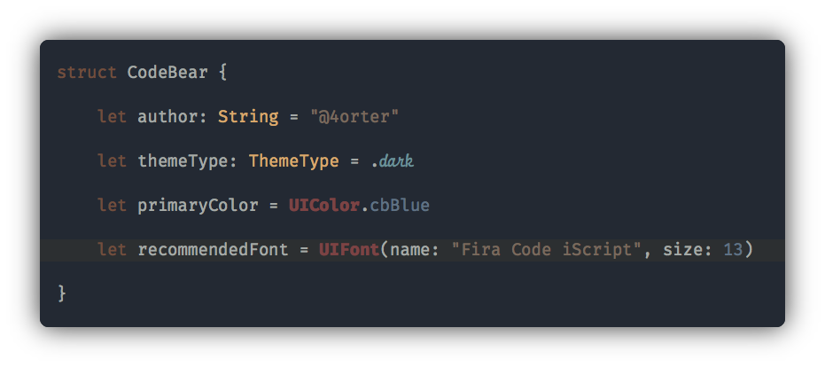

	

---

	

Font: `Fira Code iScript` by [kencrocken](https://github.com/kencrocken)

## Installation

### Using Git

	$ git clone https://github.com/4orter/CodeBear-Theme.git
	$ cd CodeBear-Theme
	$ mkdir -p ~/Library/Developer/Xcode/UserData/FontAndColorThemes/
	$ cp CodeBear.xccolortheme ~/Library/Developer/Xcode/UserData/FontAndColorThemes/
	
### Manually

	1. Download and unzip file
	2. Create themes folder: ~/Library/Developer/Xcode/UserData/FontAndColorThemes/
	3. Move CodeBear.xccolortheme file to themes folder

---

## Contributors

This theme is maintained by the following people:

 |
--- |
[Tye Porter](https://github.com/4orter) |

## License

[MIT License](./LICENSE.md)