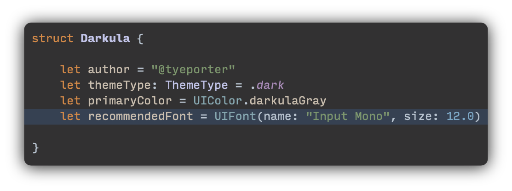
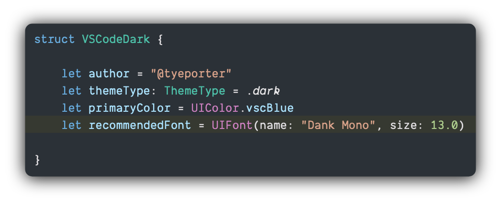
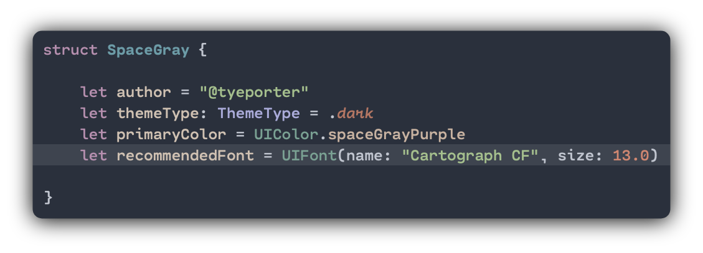

### Darkula

<p align="center">
	
</p>

Font: `Input Mono` by [DJR & Font Bureau](https://input.fontbureau.com)

---
###  Visual Studio Dark

<p align="center">
	
</p>

Font: `Dank Mono` by [Phil Plückthun](https://dank.sh)

---
### Space Gray

<p align="center">
	
</p>

Font: `Cartograph CF` by [Connary Fagen Type Design](https://www.fontspring.com/fonts/connary-fagen-type-design/cartograph-cf)

## Installation

### Manually
```
1. Download and unzip file
2. Go to folder: ~/Library/Developer/Xcode/UserData/FontAndColorThemes/
  - If FontAndColorThemes folder doesn't exist, create FontAndColorThemes folder in: ~/Library/Developer/Xcode/UserData/
3. Move each .xccolortheme file to FontAndColorThemes folder
```

### Using Git
```
$ git clone https://github.com/tyeporter/MyXcodeThemes.git
$ cd MyXcodeThemes
$ mkdir -p ~/Library/Developer/Xcode/UserData/FontAndColorThemes/
$ cp Darkula.xccolortheme ~/Library/Developer/Xcode/UserData/FontAndColorThemes/
$ cp Visual\ Studio\ Dark.xccolortheme ~/Library/Developer/Xcode/UserData/FontAndColorThemes/
$ cp Space\ Gray.xccolortheme ~/Library/Developer/Xcode/UserData/FontAndColorThemes/
```

---

## Contributors

This theme is maintained by the following people:

[](https://github.com/tyeporter) |
--- |
[Tye Porter](https://github.com/tyeporter) |

## License

[MIT License](./LICENSE.md)
